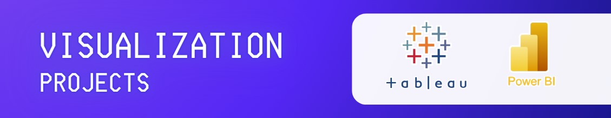

# 📂 Visualization Projects

Welcome to the section of my portfolio dedicated to projects involving **visualization**.

---

### 📚 Data Survey | Power BI

- **Description**: The goal is to showcase skills in database design, manipulation, and querying, through the implementation of a Library Management System. 
- **Queries**: `PRIMARY KEYS`, `JOINS`,  `PROCEDURES`, `FUNCTIONS`, `CTAS`, `Subquery`
- **Resource**: [`library-management.sql`](library-project)

---

### 🛍️ Soccer Player Acquition | Tableau

- **Description**: This project involves setting up a retail sales database, performing exploratory data analysis (EDA), and answering specific business questions through SQL queries.
- **Technologies**: `PostgreSQL`
- **Resource**: [`retail-sales.sql`](Retail-Sales-Project), 🔗 [Youtube Video Explanation](https://youtu.be/sSTcl4nag2Q)

---
